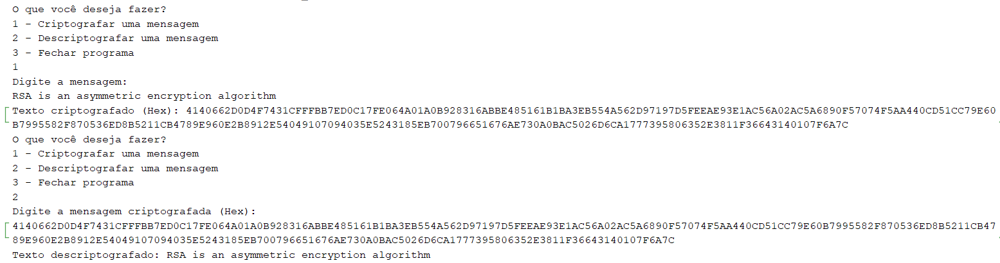

<h1 align="center">RSA Algorithm </h1>

## Project 
This project is about an asymmetric-key encryption system, which implements the RSA algorithm. Some of its characteristics are:
- A different key is used for encryption (public key) and decryption (private key), unlike symmetrical systems;
- The algorithm works with a 1024-bit key by default, which provides strong security. Larger key sizes like 2048 or 4096 bits are also common for enhanced protection;

## Algorithm Operation
To execute, the user must specify the action (encryption or decryption) and then, they enter the target message.

  <table style="border-collapse: collapse; margin: 10px;">
    
  </table>

## Technologies Used 

- **Programming Language:** Java
